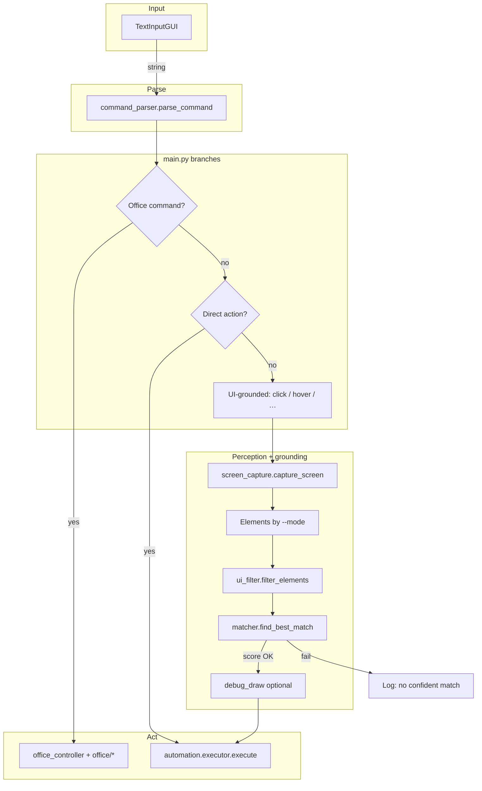

# Voice UI — typed command → parse → Office, direct keys, or grounded UI action

Windows desktop loop: floating prompt → structured command → Microsoft Office (COM), PyAutoGUI shortcuts, or **screen capture + element matching** (UIA, OCR, and/or vision).

---

## Main flow



**`--mode` (UI targets only):**

| Mode | Source |
|------|--------|
| `uia` | pywinauto UIA tree on the active window |
| `ocr` | Full-screen EasyOCR lines → element list |
| `vision` | YOLO icons + EasyOCR on local crops (`icon_utils`) |
| `both` | UIA first; if no confident match, fresh capture → vision |
| `all` | UIA → full-frame OCR → vision (three-step fallback) |

Single modes use `perception/ui_extractor.py` (`uia` / `vision`). Cascades use `perception/ui_fallback_pipeline.py` and, for OCR, `perception/ocr_elements.py`. Default: `python main.py` → `--mode uia`.

---

## Run

```bash
python main.py --mode uia      # default
python main.py --mode ocr
python main.py --mode vision
python main.py --mode both
python main.py --mode all
```

Exit phrases: `exit`, `quit`, `stop agent`, `shutdown`. Interrupt with **Ctrl+C** between commands.

---

## Layout (runtime)

```
voice-ui/
├── main.py
├── requirements.txt
├── speech/           # TextInputGUI, command_parser (Whisper path optional, not wired in main)
├── perception/       # capture, UIA / vision extractors, ocr_elements, ui_fallback_pipeline, icon_utils, filter, debug_draw
├── grounding/        # matcher (SentenceTransformers + CLIP for icons)
├── automation/       # executor (PyAutoGUI)
├── com/              # Office dispatcher + PPT/Word/Excel controllers
├── demos/            # Standalone OCR / explorer demos
└── pre/              # Prototypes — not imported by main.py
```

Vision expects **`epoch235.pt`** (YOLO) in the working directory (or where Ultralytics resolves it).

---

## Dependencies

Install from **`requirements.txt`** (PyAutoGUI, pywinauto, OpenCV, Sentence Transformers, CLIP, Ultralytics, EasyOCR, etc.). GPU is optional; COM path needs Office installed for those commands.

Use a **virtualenv**; keep `venv/` out of git (see `.gitignore`).
