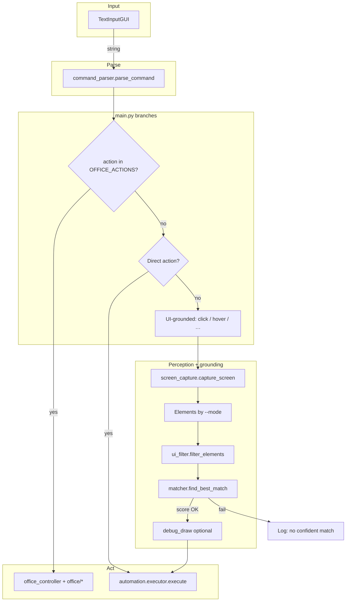

# Voice UI — typed command → parse → Office, direct keys, or grounded UI action

Windows desktop loop: floating prompt → structured command → Microsoft Office (COM), PyAutoGUI shortcuts, or **screen capture + element matching** (UIA, OCR, and/or vision).

---

## Main flow



**`--mode` (UI targets only):**

| Mode | Source |
|------|--------|
| `uia` | UIA on the active window — **default:** native on-screen walk (`IsOffscreen` + pruned DFS, `uia_onscreen_extractor`); optional classic `descendants` (see below) |
| `ocr` | Full-screen EasyOCR lines → element list |
| `vision` | YOLO icons + EasyOCR on local crops (`icon_utils`) |
| `both` | UIA first; if no confident match, fresh capture → vision |
| `all` | UIA → full-frame OCR → vision (three-step fallback) |

Single modes use `perception/ui_extractor.py` (`uia` / `vision`). Cascades use `perception/ui_fallback_pipeline.py` and, for OCR, `perception/ocr_elements.py`. Default: `python main.py` → `--mode uia`.

### UIA: on-screen (default) vs classic tree

By default, UIA stages use **`perception/uia_onscreen_extractor.py`**: a depth-first walk that respects native **`IsOffscreen`** (UIA property 30022) and skips pruned subtrees, instead of flattening with `descendants(depth=20)`.

To switch to the **classic** pywinauto tree (`descendants`), set:

| Variable | Value | Effect |
|----------|--------|--------|
| `VOICE_UI_UIA_USE_CLASSIC` | `1`, `true`, `yes`, or `on` | Classic `descendants` in `ui_extractor` |
| *(unset or any other value)* | — | On-screen native UIA (default) |

PowerShell example for classic mode:

```powershell
$env:VOICE_UI_UIA_USE_CLASSIC = "1"
python main.py --mode uia
```

Other UIA tuning (unchanged): `VOICE_UI_UIA_MAX_DEPTH` is read by `uia_onscreen_extractor`.

### Action names (single registry)

Parsed `action` strings and how they are routed are defined in **`automation/action_space.py`**:

| Set | Role |
|-----|------|
| `OFFICE_ACTIONS` | COM path — `main` / demos use `is_office_action` → `OfficeController` |
| `DIRECT_ACTIONS` | No UI grounding — straight to `automation/executor.py` (mostly PyAutoGUI; **`focus`** uses Win32 title match, see `automation/window_focus.py`) |
| `GROUNDED_ACTIONS` | Needs a matched element — perception + `matcher` → then `executor` |
| `UNKNOWN_ACTION` | No recognized phrase — `speech/command_parser.py` fallback |
| `POST_GROUNDING_CLICK_DELAY_ACTIONS` | After some grounded clicks, `main` / demos sleep briefly so UIs can open |

`OfficeController` registers handlers whose keys must match `OFFICE_ACTIONS` at startup. `main.py` and `demos/ocr_grounded_agent_demo.py` import `DIRECT_ACTIONS`, `GROUNDED_ACTIONS`, `is_office_action`, etc., from the same module so routing lists do not drift.

**`focus` (window activation):** Say `focus <substring>` (e.g. `focus Chrome`) to find a **visible top-level** window whose **title** contains that text (case-insensitive), score best match (exact / prefix / substring), then activate it with `SetForegroundWindow`. This works with many apps when several windows are open, but it cannot target by process alone, tab text inside a browser, or minimized-to-tray-only UIs; Windows may still refuse focus in some cases.

**Bring Office to the foreground:** `com/office/foreground.py` is used by the Word / Excel / PowerPoint controllers after **launching or opening** the app or a document (`open`, `open_file`, `new_*`, and related paths). It calls `Application.Activate()` when available, then `ShowWindow` / `SetForegroundWindow` (with `AttachThreadInput` when another app owns the foreground) so the Office window is more likely to appear **in front of** the agent instead of staying in the background until you click it. Windows focus rules can still prevent this occasionally (e.g. other fullscreen apps or system policies).

**Typed / spoken phrasing:** `speech/command_parser_rules.py` collapses runs of whitespace so phrases like `scroll  up` still match. For **`hotkey`**, spoken **control** is sent to PyAutoGUI as **ctrl**; **windows** becomes **win** (see `executor._normalize_hotkey_token`).

**Scroll on Windows:** Vertical/horizontal wheel uses `automation/win32_scroll.py` (`MOUSEEVENTF_WHEEL` / `MOUSEEVENTF_HWHEEL` with 120-delta steps) because PyAutoGUI’s Win32 `hscroll` path only sends a vertical wheel. The pointer must be over a scrollable surface (same as any wheel scroll).

**Executor contract:** `automation/executor.execute` returns an **`ExecuteResult`** (`ok`, `reason`). On failure, `main` / demos print `reason` so users see a concrete automation or validation error. That is separate from **parse failure** (`UNKNOWN_ACTION` from `command_parser`), which uses a different message (“could not parse as a known command …”) so misparsed input is not confused with PyAutoGUI or parameter errors.

---

## Run

```bash
python main.py --mode uia      # default
python main.py --mode ocr
python main.py --mode vision
python main.py --mode both
python main.py --mode all
```

Exit phrases: `exit`, `quit`, `stop agent`, `shutdown`. Interrupt with **Ctrl+C** between commands.

---

## Layout (runtime)

```
voice-ui/
├── main.py
├── requirements.txt
├── speech/           # TextInputGUI, command_parser (+ command_parser_rules table), office_command_parser (Whisper optional, not wired in main)
├── perception/       # capture, ui_extractor (UIA default=on-screen), uia_onscreen_extractor, grounding_cascade, ocr_elements, ui_fallback_pipeline, icon_utils, filter, debug_draw
├── grounding/        # matcher (SentenceTransformers + CLIP for icons)
├── automation/       # action_space.py, executor.py, window_focus.py (``focus``), win32_scroll.py (wheel on Windows)
├── com/              # office_controller, office/foreground.py (focus), office/* (ppt/word/excel COM); branch gated by action_space.is_office_action in main / demos
├── demos/            # Standalone OCR / explorer demos
└── pre/              # Prototypes — not imported by main.py
```

Vision expects **`epoch235.pt`** (YOLO) in the working directory (or where Ultralytics resolves it).

---

## Dependencies

Install from **`requirements.txt`** (PyAutoGUI, pywinauto, OpenCV, Sentence Transformers, CLIP, Ultralytics, EasyOCR, etc.). GPU is optional; COM path needs Office installed for those commands.

Use a **virtualenv**; keep `venv/` out of git (see `.gitignore`).
