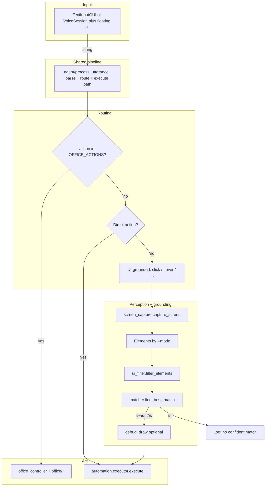

# Voice UI, typed or spoken command → parse → Office, direct keys, or grounded UI action

Windows desktop loop: **text bar** (development default) or **hands‑free voice + floating UI** → structured command → Microsoft Office (COM), PyAutoGUI shortcuts, or **screen capture + element matching** (UIA, OCR, and/or vision).

All runnable paths go through **`agent/process_utterance.py`** so behavior stays aligned. Optional **dataset logging** (`VOICE_UI_DATASET_LOG`) records executions and grounded crops to disk without changing default runtime behavior.

---

## Main flow



**`--mode` (UI targets only):**

| Mode | Source |
|------|--------|
| `uia` | UIA on the active window, **default:** native on-screen walk (`IsOffscreen` + pruned DFS, `uia_onscreen_extractor`); optional classic `descendants` (see below) |
| `ocr` | Full-screen EasyOCR lines → element list |
| `vision` | YOLO icons + EasyOCR on local crops (`icon_utils`) |
| `both` | UIA first; if no confident match, fresh capture → vision |
| `all` | UIA → full-frame OCR → vision (three-step fallback) |

Single modes use `perception/ui_extractor.py` (`uia` / `vision`). Cascades use `perception/ui_fallback_pipeline.py` and, for OCR, `perception/ocr_elements.py`. Cascade match steps return **raw frames** (no debug overlay on the frame used for grounding/dataset crops). Default: `python main.py` → `--mode uia`.

### UIA: on-screen (default) vs classic tree

By default, UIA stages use **`perception/uia_onscreen_extractor.py`**: a depth-first walk that respects native **`IsOffscreen`** (UIA property 30022) and skips pruned subtrees, instead of flattening with `descendants(depth=20)`.

To switch to the **classic** pywinauto tree (`descendants`), set:

| Variable | Value | Effect |
|----------|--------|--------|
| `VOICE_UI_UIA_USE_CLASSIC` | `1`, `true`, `yes`, or `on` | Classic `descendants` in `ui_extractor` |
| *(unset or any other value)* | — | On-screen native UIA (default) |

PowerShell example for classic mode:

```powershell
$env:VOICE_UI_UIA_USE_CLASSIC = "1"
python main.py --mode uia
```

Other UIA tuning (unchanged): `VOICE_UI_UIA_MAX_DEPTH` is read by `uia_onscreen_extractor`.

### Action names (single registry)

Parsed `action` strings and how they are routed are defined in **`automation/action_space.py`**:

| Set | Role |
|-----|------|
| `OFFICE_ACTIONS` | COM path, `main` / demos use `is_office_action` → `OfficeController` |
| `DIRECT_ACTIONS` | No UI grounding, straight to `automation/executor.py` (mostly PyAutoGUI; **`focus`** uses Win32 title match, see `automation/window_focus.py`) |
| `GROUNDED_ACTIONS` | Needs a matched element, perception + `matcher` → then `executor` |
| `UNKNOWN_ACTION` | No recognized phrase, `speech/command_parser.py` fallback |
| `POST_GROUNDING_CLICK_DELAY_ACTIONS` | After some grounded clicks, `main` / demos sleep briefly so UIs can open |

`OfficeController` registers handlers whose keys must match `OFFICE_ACTIONS` at startup. `main.py` and `demos/ocr_grounded_agent_demo.py` import `DIRECT_ACTIONS`, `GROUNDED_ACTIONS`, `is_office_action`, etc., from the same module so routing lists do not drift.

**`focus` (window activation):** Say `focus <substring>` (e.g. `focus Chrome`) to find a **visible top-level** window whose **title** contains that text (case-insensitive), score best match (exact / prefix / substring), then activate it with `SetForegroundWindow`. This works with many apps when several windows are open, but it cannot target by process alone, tab text inside a browser, or minimized-to-tray-only UIs; Windows may still refuse focus in some cases.

**Bring Office to the foreground:** `com/office/foreground.py` is used by the Word / Excel / PowerPoint controllers after **launching or opening** the app or a document (`open`, `open_file`, `new_*`, and related paths). It calls `Application.Activate()` when available, then `ShowWindow` / `SetForegroundWindow` (with `AttachThreadInput` when another app owns the foreground) so the Office window is more likely to appear **in front of** the agent instead of staying in the background until you click it. Windows focus rules can still prevent this occasionally (e.g. other fullscreen apps or system policies).

**Typed / spoken phrasing:** `speech/command_parser_rules.py` collapses runs of whitespace so phrases like `scroll  up` still match. For **`hotkey`**, spoken **control** is sent to PyAutoGUI as **ctrl**; **windows** becomes **win** (see `executor._normalize_hotkey_token`).

**Scroll on Windows:** Vertical/horizontal wheel uses `automation/win32_scroll.py` (`MOUSEEVENTF_WHEEL` / `MOUSEEVENTF_HWHEEL` with 120-delta steps) because PyAutoGUI’s Win32 `hscroll` path only sends a vertical wheel. The pointer must be over a scrollable surface (same as any wheel scroll).

**Executor contract:** `automation/executor.execute` returns an **`ExecuteResult`** (`ok`, `reason`). On failure, `main` / demos print `reason` so users see a concrete automation or validation error. That is separate from **parse failure** (`UNKNOWN_ACTION` from `command_parser`), which uses a different message (“could not parse as a known command …”) so misparsed input is not confused with PyAutoGUI or parameter errors.

---

## Run

| Goal | Command |
|------|---------|
| **Development (text bar)** | `python main.py --mode uia`, same as `--input text` (default) |
| **Hands‑free voice** | `python main.py --mode all --input voice` |
| **Dataset collection on** | Set `VOICE_UI_DATASET_LOG=1` (see [Dataset Logging](#dataset-logging)) |

```bash
python main.py --mode uia        # default mode + default text input
python main.py --mode ocr
python main.py --mode vision
python main.py --mode both
python main.py --mode all
python main.py --mode all --input text    # explicit dev text bar
python main.py --mode all --input voice   # wake phrase + floating overlay
```

**`--input`:**

| Value | Behavior |
|-------|----------|
| `text` *(default)* | Compact always‑on‑top bar (`speech/text_input_gui.py`): type a command, Enter to submit (good when mic/STT is inconvenient). |
| `voice` | Floating status widget (`speech/floating_voice_widget.py`) + wake phrase **“Hey Voice UI”** / **“Hey Voice”** + mic pipeline (`speech/voice_session.py`). |

Exit phrases (typed or spoken after wake): `exit`, `quit`, `stop agent`, `shutdown`. With **`--input voice`**, during the grace window before automation you can say **stop** (cancel this action) or **exit** (quit the app). Interrupt with **Ctrl+C** in the terminal.

---

## Share / Deploy Quick Start (Windows)

If you want another person to run this project as-is, share the repo directory with `venv` excluded (recommended), then run the following on their machine:

```powershell
cd <voice-ui-repo>
py -3.12 -m venv venv
.\venv\Scripts\Activate.ps1
python -m pip install --upgrade pip
pip install -r requirements.txt
```

Set the runtime checkpoint explicitly (recommended for stable behavior):

```powershell
$env:VOICE_UI_CLIP_CHECKPOINT = "training_data/icons_material/checkpoints/stage1_best.pt"
```

Run commands:

```powershell
# typed input (safer for first run)
python main.py --mode all --input text

# hands-free voice
python main.py --mode all --input voice
```

Notes:

- `stage1_best.pt` is the recommended default runtime model in this repository.
- `VOICE_UI_DATASET_LOG` is off by default; enable it only if you want to collect training data.
- On fresh Windows machines, microphone permission and COM-related Office setup may need one-time user approval.

---

## Voice UI (floating overlay)

**Modules:** `speech/floating_voice_widget.py` (LED state, transcript line, pipeline guide, **Confirm before run** toggle), `speech/voice_session.py` (mic → VAD → Whisper → wake phrase gate → command queue), `perception/grounding_highlight.py` (full‑screen highlight ring before execute when a Tk parent exists).

Hands‑free flow:

1. Say **Hey Voice UI**, then your command in the **same utterance** or the **next** utterance. Parser input strips the wake phrase when present (`agent/process_utterance.py`).
2. While the agent finds a UI target, the strip shows status text (“Finding target…”, etc.).
3. After grounding, the matched region is **highlighted** briefly on screen (duration scales with grace length).
4. **Grace window** (`VOICE_UI_GRACE_SECONDS`, default ~0.85s), **only when `--input voice`**: say **stop** to cancel before automation runs, or **exit** to quit the app. **`--input text` has no extra grace delay** (immediate execute path after confirmations).
5. Optional **Confirm before run** checkbox: `tkinter` confirmation dialog before Office / direct / grounded execution.

### Voice stack

| Piece | Role |
|-------|------|
| **WebRTC VAD** (`webrtcvad`) | End‑of‑utterance segmentation (preferred). If import fails, a simple **energy gate** fallback is used (install `webrtcvad` from `requirements.txt`). |
| **OpenAI Whisper** (`tiny` default) | Transcription (`speech/whisper_engine.py`); optional `transcribe_pcm16` for raw PCM. |

Wake words are matched on **Whisper text** (not a dedicated wake embedded model). Partial **live transcript** updates are best‑effort (periodic Whisper passes while you speak); final text is shown when a segment ends.

### Environment variables (voice)

| Variable | Effect |
|----------|--------|
| `VOICE_UI_GRACE_SECONDS` | Grace delay before execute / Office / direct / grounded actions when `--input voice` (default `0.85`). |
| `VOICE_UI_WHISPER_MODEL` | Whisper size (default `tiny`). |
| `VOICE_UI_WHISPER_LANG` | Force Whisper language (e.g. `ko`, `en`). Unset lets Whisper choose where supported. |
| `VOICE_UI_VAD_AGGRESSIVENESS` | WebRTC VAD `0`–`3` (default `2`). |
| `VOICE_UI_ENERGY_GATE` | RMS threshold when VAD falls back to energy gating (default `280`). |

---

## Dataset Logging

When enabled, every call to **`automation/executor.execute`** appends one JSON line to **`dataset/events.jsonl`** (`dataset/data_logger.py`). Grounded UI actions additionally save **raw** full‑frame and **bbox crop** images at successful match time from **`agent/process_utterance.prepare_grounding_artifacts`** (same code path for **`--input text`** and **`--input voice`**).

### Toggle with environment variables

| Variable | Value | Effect |
|----------|-------|--------|
| `VOICE_UI_DATASET_LOG` | `1`, `true`, `yes`, or `on` | Enable dataset logging |
| `VOICE_UI_DATASET_LOG` | *(unset or any other value)* | Disable dataset logging (default) |
| `VOICE_UI_DATASET_DIR` | path string | Dataset root directory (default: `dataset`) |
| `VOICE_UI_DATASET_EXTRA_NEGATIVES` | integer or `true` | After each **successful** grounded match, append up to *N* extra JSONL rows + crops for **other** candidates on the same frame (hard negatives for ranking / contrastive training). `true` → 6. `0` or unset → off. |

PowerShell examples:

```powershell
$env:VOICE_UI_DATASET_LOG = "1"
$env:VOICE_UI_DATASET_DIR = "dataset"
python main.py --mode all --input text

$env:VOICE_UI_DATASET_LOG = "1"
python main.py --mode all --input voice

# Same utterance → many more rows per click (hard negatives; same frame_path, new crop files)
$env:VOICE_UI_DATASET_LOG = "1"
$env:VOICE_UI_DATASET_EXTRA_NEGATIVES = "10"
python main.py --mode uia --input text
```

### Hard negatives (optional, automatic)

With **`VOICE_UI_DATASET_EXTRA_NEGATIVES`** set, each successful grounding still runs **`execute`** once, but **`events.jsonl`** gains additional lines tagged **`meta.label` = `"negative_hard"`** (`meta.pair_event_id` points at the positive row’s `event_id`). Each extra line gets its own **`dataset/crops/<uuid>.png`** for a non-chosen candidate bbox. No extra clicks, volume scales with how often you already use the agent.

### What gets written

When enabled, the logger writes:

- `dataset/events.jsonl`: one JSON line per `execute(...)` call (or per auto-collect probe)
- `dataset/frames/*.png`: full frame at grounded-action time; **auto-collect** saves **one frame per UIA scan** (`artifacts.frame_id` shared by multiple crops from the same look)
- `dataset/crops/*.png`: one crop per target bbox (unique `event_id` per row)
- `dataset/crops/*.png`: crop from matched target `bbox` (when available)

### Event fields

Core fields include:

- `event_id`, `ts`, `session_id`
- `raw_text`, `action`, `query`, `mode_used`
- `ok`, `reason`
- `target` (`name`, `bbox`, `center`)
- `artifacts` (`frame_path`, `crop_path`)

### Important behavior guarantees

- Logging is best-effort and isolated from execution; logger errors are swallowed so automation keeps running.
- Default behavior is unchanged because logging is OFF unless explicitly enabled.
- Dataset frame/crop use the **raw capture** (before **match/candidate** debug overlays). Debug snapshots may still be written under `test_screen_img/` by `perception/debug_draw.show_debug` for developer inspection.

### Runtime toggles (text / dev mode only)

With **`--input text`**, you can change dataset behaviour **without restarting** by typing into the floating bar (same place as normal commands). Lines starting with **`!dataset`** are handled first and are **not** sent to the command parser.

| Command | Effect |
|---------|--------|
| `!dataset` or `!dataset status` | Print effective log on/off, extra-negative cap, and env values |
| `!dataset on` / `off` | **Force** dataset logging on or off (overrides `VOICE_UI_DATASET_LOG`) |
| `!dataset env` | Clear log override → follow **`VOICE_UI_DATASET_LOG`** again |
| `!dataset negs 10` | **Force** extra hard-negative cap (same as env integer) |
| `!dataset negs env` | Clear negs override → follow **`VOICE_UI_DATASET_EXTRA_NEGATIVES`** |
| `!dataset envlog on` / `off` | Set `VOICE_UI_DATASET_LOG` in-process and clear override |
| `!dataset envnegs 8` / `unset` | Set or remove `VOICE_UI_DATASET_EXTRA_NEGATIVES` in-process and clear override |
| `!dataset reset` | Clear both overrides (everything follows env) |

`dataset/data_logger.py` reads these effective values on **every** log call, so overrides apply immediately to the next action.

### Automatic collection (whitelist, no real clicks)

Use `tools/auto_collect_runner.py` with `configs/collect_targets.json` to auto-focus
approved windows and log UIA icon-like probes into `dataset/events.jsonl` and
`dataset/crops/` **without executing real clicks**.

```powershell
python tools/auto_collect_runner.py --config configs/collect_targets.json --force-enable-dataset-log
```

Notes:
- Whitelist only trusted app/window title substrings in `configs/collect_targets.json`.
- Default behavior is safe collection (synthetic `auto_collect_probe:*` events).
- Add `--add-hard-negs` to also emit `negative_hard` rows for non-chosen candidates.
- **`--auto-launch`**: start Chrome / Edge / VS Code / PowerPoint (etc.) if not already open — see
  `auto_launch.presets` in `configs/collect_targets.json`. UIA still needs a visible window
  (not minimized). Per-target override: `"launch": "chrome"`, `"launch_args": ["--new-window"]`.
- **Maximize before scan** (default on): `collection.maximize_window` in config, or `--no-maximize`
  to disable. Uses Windows maximize (work area), not exclusive fullscreen.
- **Auto-discover installed apps**: `--auto-discover` or `auto_discover.enabled` in config scans
  registry + Start Menu (Figma, Slack, …) and merges into targets with `launch` exe paths.
  Preview: `python tools/discover_collect_targets.py`. Static `targets` in config take precedence
  when titles overlap.

**Browser chrome vs page UI:** Chrome/Edge whitelist targets default to `browser_ui.mode:
chrome_only` (toolbar/window buttons on a blank/new tab only). History traversal defaults to
`page_only` (skip reload/minimize/close duplicates on every site). Override per target in
`configs/collect_targets.json`.

**Browser history traversal (Chrome / Edge):** open recent local history URLs, wait for each
page to load, then run the same UIA icon-like probe logging. Events include
`meta.source_url`, `meta.page_title`, `meta.browser`, and `meta.domain`.

```powershell
# History only (no static targets)
python tools/auto_collect_runner.py --from-history chrome --history-only --history-limit 15 --force-enable-dataset-log

# Chrome + Edge, then also collect static whitelist windows
python tools/auto_collect_runner.py --from-history both --force-enable-dataset-log
```

Or set `"browser_history": { "enabled": true, ... }` in `configs/collect_targets.json`.
Domain filters: `domain_allowlist` / `domain_blocklist`. History is read from the local
Chromium SQLite DB (copied while locked); only `http(s)` URLs are opened.

### Nightly command (PowerShell Task Scheduler friendly)

```powershell
cd C:\Users\keti\Desktop\git-clone-repo\voice-ui
powershell -ExecutionPolicy Bypass -File tools\collect_stage2_full.ps1
```

Or manually:

```powershell
cd C:\Users\keti\Desktop\git-clone-repo\voice-ui
$env:VOICE_UI_DATASET_LOG="1"
$env:VOICE_UI_DATASET_EXTRA_NEGATIVES="6"
venv\Scripts\python.exe tools/auto_collect_runner.py --config configs/collect_targets.json --auto-launch --auto-discover --from-history both --history-limit 25 --page-load-ms 5000 --add-hard-negs --force-enable-dataset-log
venv\Scripts\python.exe training_data/icons_material/export_stage2_pairs.py
```

`tools/collect_stage2_full.ps1` runs the same pipeline (optional `-DryRun`, `-HistoryLimit 30`, `-NoDiscover`, `-NoHistory`, `-SkipExport`).

---

## Layout (runtime)

```
voice-ui/
├── main.py
├── agent/            # process_utterance (shared text + voice pipeline)
├── dataset/          # data_logger (optional events.jsonl + frames/crops)
├── requirements.txt
├── speech/           # TextInputGUI, floating_voice_widget, voice_session (wake + VAD), whisper_engine, command_parser (+ rules), office_command_parser
├── perception/       # capture, ui_extractor, grounding_cascade, grounding_highlight, ocr_elements, ui_fallback_pipeline, icon_utils, filter, debug_draw
├── grounding/        # matcher (SentenceTransformers + CLIP for icons)
├── automation/       # action_space.py, executor.py, window_focus.py (``focus``), win32_scroll.py (wheel on Windows)
├── com/              # office_controller, office/foreground.py (focus), office/* (ppt/word/excel COM); branch gated by action_space.is_office_action in main / demos
├── demos/            # Standalone OCR / explorer demos
└── pre/              # Prototypes — not imported by main.py
```

Vision expects **`epoch235.pt`** (YOLO) in the working directory (or where Ultralytics resolves it). **CLIP:** if `training_data/icons_material/checkpoints/stage1_best.pt` exists (after `train_stage1.py`), it loads automatically; override with **`VOICE_UI_CLIP_CHECKPOINT`** (set to `off` for OpenAI baseline only). After stage-2 training, point runtime at `checkpoints/stage2_best.pt` the same way.

### Stage-2 CLIP training (runtime crops)

```powershell
venv\Scripts\python.exe training_data/icons_material/export_stage2_pairs.py
venv\Scripts\python.exe training_data/icons_material/train_stage2.py --epochs 10 --batch-size 32
```

- **Init:** `stage1_best.pt` (read-only; not overwritten).
- **Output:** `checkpoints/stage2_best.pt`, `checkpoints/stage2_epoch*.pt`, log `train_stage2.log`.
- **Runtime:** `$env:VOICE_UI_CLIP_CHECKPOINT="training_data/icons_material/checkpoints/stage2_best.pt"` before `main.py` / auto-collect.
- **Experiment log:** checkpoint metrics, eval tables, and deployment notes — [`training_data/icons_material/EXPERIMENTS.md`](training_data/icons_material/EXPERIMENTS.md).

---

## Dependencies

Install from **`requirements.txt`**: PyAutoGUI, pywinauto, OpenCV, Sentence Transformers, CLIP, Ultralytics, EasyOCR, **webrtcvad** (voice end‑pointing; optional fallback if missing), PyAudio, OpenAI Whisper, etc. GPU is optional; COM path needs Office installed for those commands.

Use a **virtualenv**; keep `venv/` out of git (see `.gitignore`).

---

## Environment variables (quick reference)

| Variable | Area | Purpose |
|----------|------|---------|
| `VOICE_UI_UIA_USE_CLASSIC` | UIA | Classic `descendants` tree instead of on-screen walk |
| `VOICE_UI_DATASET_LOG` | Dataset | Enable `events.jsonl` + frame/crop artifacts |
| `VOICE_UI_DATASET_DIR` | Dataset | Root folder (default `dataset`) |
| `VOICE_UI_DATASET_EXTRA_NEGATIVES` | Dataset | Max hard-negative rows per successful grounding (`true` → 6) |
| `VOICE_UI_GRACE_SECONDS` | Voice | Pre‑execute cancel window when `--input voice` |
| `VOICE_UI_WHISPER_MODEL` / `VOICE_UI_WHISPER_LANG` | Voice / STT | Whisper size and language |
| `VOICE_UI_VAD_AGGRESSIVENESS` / `VOICE_UI_ENERGY_GATE` | Voice / VAD | WebRTC VAD level or energy fallback threshold |
| `VOICE_UI_YOLO_IMGSZ` | Vision / YOLO | **`auto`** (default): scale inference from capture size (~long_edge/3, 640–1536). **`1280`**: fixed size. **`off`**: Ultralytics default 640 always. Helps small icons on large desktops. |
| `VOICE_UI_CLIP_CHECKPOINT` | Vision / CLIP | Override checkpoint path (or ``off`` = baseline). **Unset:** auto-load ``training_data/icons_material/checkpoints/stage1_best.pt`` if that file exists. |
