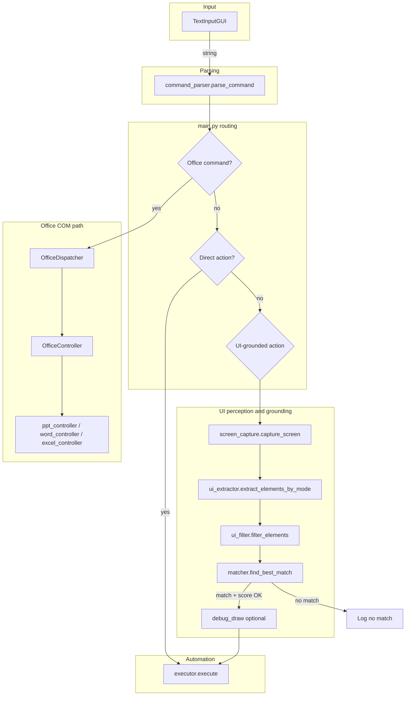

# Voice-Control: command input → UI grounding → automation

Windows-focused loop: you enter a natural-language command, the system parses it, then either runs Microsoft Office via COM, runs keyboard/mouse automation directly, or grounds the command to on-screen UI (accessibility tree or vision) and acts on the best match.

---

## Entry point and how to run

| Item | Detail |
|------|--------|
| **Script** | `main.py` |
| **CLI** | `python main.py --mode {uia\|vision\|both}` |
| **Default mode** | `uia` |

`--mode` selects how UI elements are collected for actions that need a screen target (`click`, `hover`, etc.):

- **`uia`**: Windows UI Automation (pywinauto) on the active window.
- **`vision`**: Screen capture → YOLO icon boxes → EasyOCR text on crops (no UIA).
- **`both`**: Try UIA matching first; if confidence is low, recapture and match on vision elements.

---

## Directory layout (active runtime vs. experiments)

```
voice-control/
├── main.py                 # Orchestrator loop (sole runtime entry)
├── requirments.txt         # Pip dependencies (see file for install hints)
│
├── speech/                 # Command text in + parsing
│   ├── text_input_gui.py   # Primary input: floating Tk prompt → string
│   ├── command_parser.py   # string → structured command dict
│   ├── listener.py         # Optional: microphone → AudioData (not used by main)
│   └── whisper_engine.py   # Optional: AudioData → text (not used by main)
│
├── perception/             # “What is on screen?”
│   ├── ui_extractor.py     # mode → list of UI element dicts
│   ├── ui_filter.py        # raw elements → filtered normalized dicts
│   ├── screen_capture.py   # → OpenCV BGR frame (whole screen)
│   ├── icon_utils.py       # frame → icon boxes + OCR text; CLIP helpers for matcher
│   └── debug_draw.py       # frame + elements/match → visualization window
│
├── grounding/              # “Which element matches the query?”
│   └── matcher.py          # (query, elements, screen) → (best_element, score)
│
├── automation/             # Low-level input
│   └── executor.py         # (action, element?, params) → PyAutoGUI calls
│
├── com/                    # Microsoft Office via COM
│   ├── office_dispatcher.py  # classifies office vs. non-office commands
│   ├── office_controller.py  # routes to app-specific controllers
│   └── office/
│       ├── ppt_controller.py
│       ├── word_controller.py
│       └── excel_controller.py
│
└── pre/                    # Prototypes / benchmarks / bundled models (not imported by main.py)
    ├── experim/
    ├── proto_kor/
    └── …
```

---

## File roles, inputs, and outputs

### `main.py` (orchestrator)

| Input | Output / side effects |
|-------|------------------------|
| `--mode` | Chooses UIA / vision / hybrid extraction and score thresholds |
| User string from `TextInputGUI.get_input()` | Parsed command; branch to Office, direct PyAutoGUI, or UI pipeline |
| Parsed `command` dict | Calls `execute()` or `office.execute()`; optional debug overlays |

**Branches (high level):**

1. **Shutdown phrases** → exit loop.
2. **`OfficeDispatcher.is_office_command`** → `OfficeController.execute(command)` (COM).
3. **`action` in `DIRECT_ACTIONS`** → `execute(action, element=None, params=command)` (no grounding).
4. **Otherwise** → capture screen → extract/filter elements → `find_best_match` → if score OK, `execute(action, element=match, params=command)`.

---

### `speech/text_input_gui.py`

| Input | Output |
|-------|--------|
| User typing + Enter in always-on-top window | `str` (command line) |
| (Window hides after submit so focus can return to the target app.) | |

---

### `speech/command_parser.py`

| Input | Output |
|-------|--------|
| Raw text line | `dict`: at least `action`; optional `query`, `text`, `direction`, Office-specific keys (`row`, `col`, `value`, …) |
| | `action: "unknown"` when no pattern matches |

---

### `perception/ui_extractor.py`

| Input | Output |
|-------|--------|
| `mode`: `"uia"` \| `"vision"` \| `"both"` | `list` of element dicts: `name`, `control_type`, parent info, `bbox`, `center`, `is_icon` |
| **uia** | pywinauto descendants of active top window |
| **vision** | `icon_utils.detect_icons(screen)` on a fresh capture |
| **both** | UIA list only (vision fallback happens in `main.py`, not here) |

---

### `perception/ui_filter.py`

| Input | Output |
|-------|--------|
| Raw elements from extractor | Subset with normalized lowercase fields; drops unnamed non-icons; keeps icons even without text |

---

### `perception/screen_capture.py`

| Input | Output |
|-------|--------|
| (none) | BGR `numpy` image via PyAutoGUI screenshot + OpenCV |

---

### `perception/icon_utils.py`

| Input | Output |
|-------|--------|
| BGR frame | YOLO boxes (class 0) → padded crops → EasyOCR `text` per icon |
| (module load) | Shared `YOLO`, `CLIP`, `device` for `grounding/matcher.py` |

**External assets:** expects `epoch235.pt` (YOLO weights) where Ultralytics can load it (typically project CWD).

---

### `perception/debug_draw.py`

| Input | Output |
|-------|--------|
| Frame + element list or single match | Annotated image; `show_debug` opens an OpenCV window |

---

### `grounding/matcher.py`

| Input | Output |
|-------|--------|
| `query` string, `elements` list, optional `screen` BGR frame | `(best_element \| None, score)` |
| Non-icon elements | SentenceTransformer text similarity (`all-MiniLM-L6-v2`) |
| Icon elements | CLIP image crops vs. text query (batched where possible) |

---

### `automation/executor.py`

| Input | Output |
|-------|--------|
| `action`, optional `element` (for `center`), `params` | Mouse move/click/scroll, keys, `type` text via PyAutoGUI |

---

### `com/office_dispatcher.py` / `com/office_controller.py` / `com/office/*.py`

| Input | Output |
|-------|--------|
| Parsed command with Office `action` | COM automation against PowerPoint / Word / Excel |
| | `True` / `False` success flag to `main.py` |

---

### `speech/listener.py` / `speech/whisper_engine.py`

| Role | Note |
|------|------|
| Microphone → audio; audio → text | **Not wired in `main.py`**. `TextInputGUI` is the current input path. |

---

## End-to-end execution flow



**`both` mode in `main.py` (conceptual):** UIA elements are extracted and matched first; if the score is not above the UIA threshold, the screen is recaptured and vision elements are extracted and matched with the vision threshold.

---

## Dependencies (reference)

See `requirments.txt` for packages (PyAutoGUI, pywinauto, OpenCV, Whisper stack, Sentence Transformers, CLIP, Ultralytics YOLO, EasyOCR, etc.). The **runtime path** in `main.py` assumes a Windows desktop with an Office install when using COM commands, and GPU is optional but used when available for vision/CLIP.

---

## `pre/` folder

Scripts, Korean prototypes, Vosk model files, and experiment logs live under `pre/`. **They are not part of the `main.py` import graph**; treat them as research or legacy material unless you wire them in yourself.
